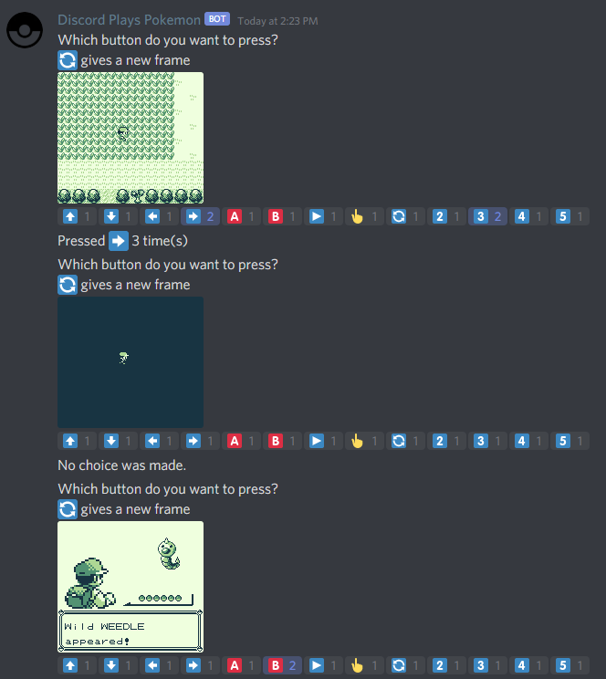
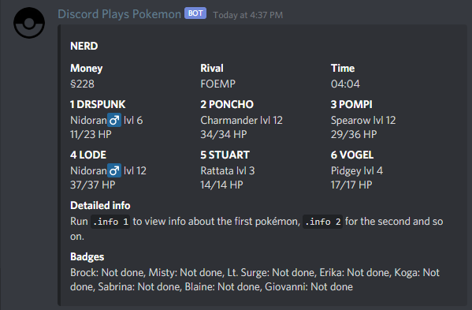
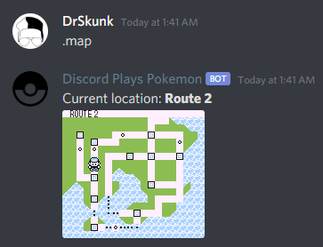
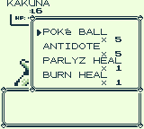

# Discord plays Pokémon

Server application made in typescript that allows a discord server to play a gameboy game using only a text channel. The bot posts a frame of the game and the players use the reactions to vote for a button to be pressed.

The `info` command also has detailed info read from the emulator's RAM like Pokémon stats.  

The `map` command creates map with your current position.  

It also automatically creates summary gifs every two hours.  

Check the `help` command for all commands.

## Installation

This requires [NodeJS](https://nodejs.org/en/) to be installed.

Clone `discord-plays-pokemon` into a directory and `cd` into it. Then run the command `npm install` to install all dependencies.

To start the application after setting the questions and the config file, run `npm start`.

## Config file

Copy `.env.example` to `.env` and fill in your details:

- `PREFIX`: The prefix for the commands.
- `DISCORD_TOKEN`: Your Discord bot token.
- `DISCORD_GUILD_ID`: The ID of the server/guild where the bot will run.
- `DISCORD_CHANNEL_ID`: The ID of the text channel where the bot will listen to and post messages.
- `ROMFILE`: Place your romfile in the `/roms` directory and use the filename here, like `pokemon.gb`
- `MODE`: Either `ANARCHY` or `DEMOCRACY` (see below).
- `DEMOCRACY_MODE_TIMEOUT`: Duration in milliseconds to wait for input in democracy mode, must be set in anarchy mode too, but it's not used then.
- `SCALE`: Scale of the output image to be sent as an image. base resolution is 160x144. Must be between 1 and 6 inclusive. 3 is the recommended maximum.
- `WEB_PORT`: port to run the debug interface on, e.g. when 2020 it's accessible on [`http://localhost:2020`](http://localhost:2020).
- `SAVESTATE_INTERVAL`: Amount of minutes between autosaving. Will be saved to the `./saves` directory. Set to `0` to disable. **NOTE:** These are savestates, not ingame saves.

You can create a Discord bot token by going to [the Discord developer portal](https://discord.com/developers/applications/) to create a new application. Then go to `Bot` and click `Copy` under `Token`.

You can find your Guild ID and Text channel ID by enabling developer mode on your Discord client and then rightclicking the server/channel and press `Copy ID`.

## Anarchy mode vs Democracy mode

When using _anarchy mode_, the first reaction will be used to press a button, others will be ignored. The bot will then reply after pressing it with a new prompt.

When using _democracy mode_, the bot will post a screenshot and wait for a set amount. After that the move with the most votes will be executed. When it's a draw, one of the top votes will be executed randomly.

## Credits

Pokémon pixel font by SpyroSteak on Fontstruct: https://fontstruct.com/fontstructions/show/299827/pokemon_pixel_font
